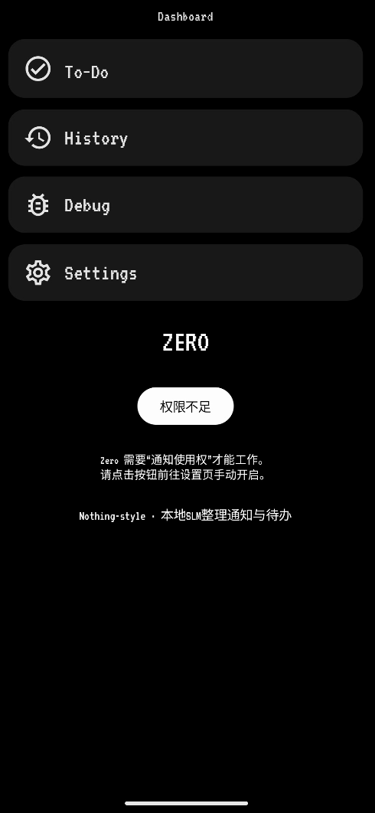
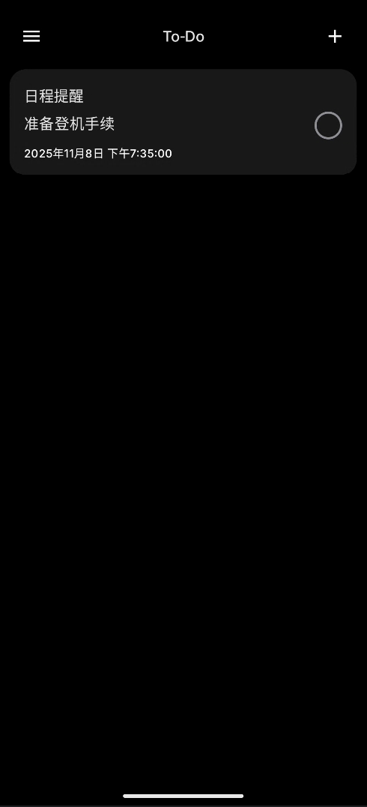

# Zero

一个在本地端智能地分流与提取通知的 Android ToDo APP：
- L1 门卫（优先级）模型：将通知分为 HIGH / MEDIUM / LOW
- L2 意图分类（MediaPipe）：识别验证码、未接来电、财务变动、物流信息、工作沟通、日程提醒等
- L3-B 小语言模型（SLM，经 llama.cpp JNI）：从复杂通知中抽取意图、摘要与截止时间（JSON）
- 将重要通知转化为待办（To‑Do），并提供桌面小部件快速浏览与标记完成

**Dashboard 首屏的权限提示与入口、To‑Do 列表与手动添加、History 分类列表、Settings 配置项、Dataset/Model 管理、桌面 To‑Do 小部件。**

## 项目概览与目标
- 目标：在本地端侧高效、可靠地处理通知，智能分流与抽取关键信息，转化为待办事项，尽量减少打扰与噪音。
- 设计原则：
  - 优先本地、轻量、可控；尽量避免云依赖。
  - 逐层处理：L1 门卫、L2 意图、L3‑B SLM 解析；遇到复杂场景再升级处理。
  - 背景任务遵守设备状态与电量门控，减少性能、续航影响。

## 快速开始（构建与运行）
- 环境：Android Studio（含 NDK / CMake 支持）、JDK 17+，macOS/Windows/Linux 皆可。
- 第三方：`third_party/llama.cpp` 需可用（CMakeLists 已使用 `add_subdirectory` 引入）。
- 模型与资产：
  - L1 门卫模型：`app/src/main/assets/models/l1_gatekeeper_model.tflite`（或夜间训练生成的 `noBackupDir/models/L1_learned.tflite`）。
  - L2 意图分类：`app/src/main/assets/models/l2_processor_intent.tflite`（MediaPipe TextClassifier）。
  - L3 SLM 种子模型：`app/src/main/assets/models/l3_processor_model.Q5_K_M.gguf`。
  - 语法约束（GBNF）：`app/src/main/assets/Grammar/json_ie.gbnf`。
  - 数据集：`app/src/main/assets/datasets/`（训练与评测 CSV）。
- 首次运行步骤：
  - 打开 App，按照 Dashboard 的引导授予“通知使用权”。
  - 在 Settings 中配置电量阈值与 L3 线程数（根据设备性能调整）。
  - 如需桌面 To‑Do 小部件：在桌面添加“Zero To‑Do”。

## 功能与界面

**Dashboard**（`ui/screen/DashboardScreen.kt`）

- 展示主要入口：To‑Do、History、Debug、Settings。

- 若未授予通知监听权限，显著提示并提供跳转设置页入口。

  

**To‑Do 列表**（`ui/screen/TodoScreen.kt`）
- 显示待办列表，支持手动添加（含意图识别与截止时间抽取；L3 解析成功或回退时会同步更新摘要与到期时间）。
- 显示处理中进度（当通知触发 L2/L3），支持标记完成、设置到期。
- 

**History（历史）**（`ui/screen/HistoryScreen.kt`）
- 分类显示通知：高/中/低优先级；支持清空、改标签、删除。
- 列表项含 App 图标、名称、标题与正文，提供下拉菜单操作。

**Settings（设置）**（`ui/screen/SettingsScreen.kt`）
- 配置电量阈值、L3 线程数；跳转到数据集管理与模型管理。
- 注：已移除设置页中的“L1 模型选择”卡片，改由“模型管理”页统一开关与选择。
- L1 融合判断：启用后对 TFLite 与 Naive Bayes 进行融合；可调 TFLite 权重（NB 权重自动为 1 − TFLite）。
- 默认：融合关闭、权重 0.5/0.5；阈值 MP=0.70、NB=0.70。
- 调试：查看日志 `ZeroL1-MP`、`ZeroL1-NB`、`ZeroL1-Fusion`。
- 需要配图：
  - 设置页总览 → `docs/images/settings_main.png`
  - L1 融合判断设置 → `docs/images/settings_l1_fusion.png`

**Dataset 管理**（`ui/screen/DatasetManageScreen.kt`）
- 管理 `L1.csv`：展示大小与行数；导出、编辑（最近 50 行）、清空数据集。
- 显示 L1 训练进度与预计剩余时间；提供“训练（NB）”按钮，直接触发端侧朴素贝叶斯训练。
- 训练完成且准确率≥90%时自动采用导出模型（优先 TFLite，其次 NB JSON），并更新设置。
- 需要配图：
  - 数据集管理页（含进度条/剩余时间与训练按钮）→ `docs/images/dataset_manage.png`

**Model 管理**（`ui/screen/ModelManageScreen.kt`）
- 管理本地 `.tflite` 与 `.json`（Naive Bayes）模型：展示名称、大小、准确率（读取同名或目录下 `metrics.json`）；选择与导出。
- 提供“使用本地训练模型”开关与“使用此模型”按钮，统一在此页面完成模型切换。
- 需要配图：
  - 模型管理页（含准确率展示与 NB/TFLite 列表）→ `docs/images/model_manage.png`

**Debug（调试）**（`ui/screen/DebugScreen.kt`，若存在）
- 调试入口，便于查看 L2/L3 识别情况与线程覆盖等。

## 架构与数据流
- 入口与导航：
  - `MainActivity.kt` 作为入口，支持 `intent extra: open_route`（如 `todos`）。
  - `ZeroApp.kt` 初始化 SLM 运行时、设置通知渠道（验证码复制按钮）、调度夜间训练。
  - `NavGraph.kt` 定义路由：`dashboard`, `todos`, `history`, `debug`, `settings`, `dataset`, `models`。
- 数据流：
  - `ZeroNotificationListenerService.kt` 捕获系统通知，仅运行轻量 L1 模型，忽略常驻（ongoing）。
  - HIGH/MEDIUM 优先级分别进入 `ProcessIncomingNotification` 或 `WorkManager` 的后台处理。
  - L2 分流：可 Regex 即时处理（验证码/未接来电），或交由 L3‑B SLM 解析复杂意图。
  - 抽取到的待办写入 `Room`，并刷新桌面 To‑Do 小部件。

## 模型与处理器（L1/L2/L3）
- L1 门卫（`ml/PriorityClassifier.kt`）：
  - 基于 MediaPipe `TextClassifier`（CPU delegate），将通知分类为 HIGH/MEDIUM/LOW。
  
  - 文本统一预处理：`L1TextPreprocessor.asciiNormalizeForL1` 执行 NFKC 规范化、URL/Email/Phone/Code/运单号占位替换、空白压缩与小写化，并将中文转为拼音或码点；训练（CSV 合并）与推理一致。
  
  - 动态加载模型：优先本地学习模型（如存在且启用），否则使用 assets 模型；选择 NB JSON 可在“模型管理”页完成；失败时关键词回退。
  
  - 融合判断（可配置）：支持选择 JSON（Naive Bayes）模型并与 MediaPipe 融合；当融合开启时，若 MP 置信度≥0.70 直接采用，否则若 NB 置信度≥0.70 采用，否则按用户权重（默认 0.5/0.5）对三类分布加权融合；当融合关闭且选择 JSON，仅使用 NB。
  
  - 模型加载修正：选择 JSON 时，MediaPipe 资产模型可作为回退以支持融合初始化。
  
    
  
- L2 意图（`ml/NlpProcessor.kt`）：
  - 使用 MediaPipe TextClassifier 识别意图。
  - L3‑A 正则引擎：对“验证码”“未接来电”即时处理并生成待办或通知复制按钮。
  - L3‑B 分流：对“工作沟通”“日程提醒”“社交闲聊”“财务变动”“物流信息”交由 SLM。
  
- L3‑B SLM（`ml/L3_SLM_Processor.kt` + `cpp/llama_jni.cpp`）：
  - 通过 JNI 调用 `llama.cpp`，按 ChatML prompt + GBNF 语法生成严格 JSON（`intent`, `summary`, `due_time`）。
  - 内置超时与回退：JNI 失败或输出非 JSON 时，回退到规则/猜测。
  - 可覆盖线程数与 GPU 层（默认 CPU-only，GPU 根据设备探测）。

## 后台任务与训练流程
- `L2L3ProcessWorker.kt`：
  - MEDIUM 任务门控：屏幕无活动或锁屏；电量不低或在充电；否则重试。
  - 批处理通知，L2/L3 识别后写入待办；验证码场景发出复制按钮通知。
- `MediumPriorityWorker.kt`：
  - 批量处理 `nextMediumBatch`，调用 SLM 并写入待办，线程数取自 Settings。
- `NightlyTrainingWorker.kt`：
  - 占位 worker（No‑Op），设计用于设备空闲/充电/夜间的 on‑device 训练或标注导出。
- `L1NightTrainWorker.kt`：
  - 夜间/强制训练 L1：合并数据集、写训练请求、记录进度（0..80）。
  - 合并 CSV 时使用统一文本预处理（`L1TextPreprocessor`），确保与推理一致。
  - 端侧朴素贝叶斯训练：`L1NaiveBayes.trainAndExport(...)` 将模型导出到 `gatekeeper_export`。
  - 训练完成若准确率≥90%，优先采用导出的 TFLite（存在时），否则采用 NB JSON；均更新设置与度量文件。
  - 兼容导出目录：`gatekeeper_export/` 与 `awe_export_ascii/`（均可包含 `model.tflite`、`model_nb.json` 与 `metrics.json`）。

## 权限与系统集成
- Manifest：
  - `READ_PHONE_STATE`, `INTERNET`, `ACCESS_NETWORK_STATE`, `WAKE_LOCK`, `FOREGROUND_SERVICE`, `RECEIVE_BOOT_COMPLETED`。
  - 读取外部存储（用于本地模型加载）：`READ_EXTERNAL_STORAGE`。
- 通知监听服务：`ZeroNotificationListenerService`（需系统设置中授予）。
- 通知渠道：验证码复制按钮使用专用渠道（`ZeroApp.kt` 中创建）。
- 需要配图：
  - 系统权限页（通知使用权）→ `docs/images/permission_notification_access.png`

## 数据存储与持久化
- Room 数据库：`ZeroDatabase.kt`（表 `notifications`, `todos`）。
  - `NotificationEntity`：key/pkg/title/text/postedAt/priority/userPriority/processed/pushed。
  - `TodoEntity`：id/title/dueAt/createdAt/status/sourceNotificationKey。
- 仓库：`ZeroRepository.kt` 封装读写与流，写入待办后刷新桌面 Widget。
- 需要配图：
  - 简易 ER 图（Notification/Todo 关系）→ `docs/images/db_er.png`

## 资源与资产（assets）
- `assets/Grammar/`：GBNF 语法（`json_ie.gbnf`）。
- `assets/models/`：L1/L2 种子模型与 L3 GGUF 模型。
- `assets/datasets/`：CSV 训练/测试数据。
- `assets/fonts/`：字体资源（如需要）。
- 需要配图：
  - 资源目录结构快照 → `docs/images/assets_tree.png`

## 桌面小部件（Widgets）
- Glance `ZeroWidget.kt`：显示最近 HIGH 优先级推送的标题（最多三条）。
- AppWidget `TodoWidgetProvider.kt` + `TodoWidgetService.kt`：
  - 显示“今天/明天”到期的待办（5 条以内）；支持“切换明天”“手动刷新”。
  - 点击列表项可直达 App 的 To‑Do 页面；支持在列表中标记完成（广播）。
  - 稳定性优化：使用部分更新与适配器数据刷新，避免主机重绑引起缩放异常。
- 需要配图：
  - 桌面 To‑Do 小部件（正常与“明天”切换）→ `docs/images/widget_todo.png`
  - Glance Widget（HIGH 通知概览）→ `docs/images/widget_glance.png`

## 截图与配图清单（需要配图）
- Dashboard 权限提示与入口 → `docs/images/dashboard_permission.png`
- To‑Do 列表与手动添加 → `docs/images/todo_list.png`, `docs/images/todo_manual_add.png`
- History 分类列表与操作菜单 → `docs/images/history_list.png`
- Settings 总览与 L1 模型开关 → `docs/images/settings_main.png`, `docs/images/settings_l1_model.png`
- Dataset 管理页（进度/剩余时间） → `docs/images/dataset_manage.png`
- Model 管理页（准确率展示） → `docs/images/model_manage.png`
- 数据流示意与训练流程图 → `docs/images/arch_flow.png`, `docs/images/training_flow.png`
- 权限设置页（通知使用权） → `docs/images/permission_notification_access.png`
- DB ER 图 → `docs/images/db_er.png`
- 资源目录结构快照 → `docs/images/assets_tree.png`
- 桌面小部件（To‑Do/Glance） → `docs/images/widget_todo.png`, `docs/images/widget_glance.png`

配图拍摄建议：
- 使用真机或模拟器，分辨率建议 ≥1080p；避免隐私信息泄露（可打码）。
- UI 切换/动画建议录制短动图（GIF/MP4），并在 README 以静帧替代或提供链接。
- 文件/架构图可用 Draw.io/Figma 绘制，统一配色与布局。

## 已完成 / 未完成 

已完成
- 通知监听与存储：捕获并去重保存（`ZeroNotificationListenerService` + Room）。
- L1 门卫与回退：MediaPipe 模型 + 关键词回退；线程安全与动态模型加载。
- L2 意图与分流：Regex 即时处理 + 复杂意图交由 SLM。
- L3‑B SLM 集成：llama.cpp JNI（CMake 引入），GBNF 约束输出严格 JSON，含超时与回退。
- 待办与小部件：To‑Do 列表、桌面部件（今天/明天切换）、快速标记完成。
- 权限与渠道：通知使用权引导、验证码复制通知渠道。
- 设置与管理：电量阈值、L3 线程数；数据集/模型管理页面（模型选择统一在模型管理页）。
- 背景任务：中优先级门控与批处理；夜间 L1 训练流程与自动采用条件。

未完成 / 待完善
- NightlyTrainingWorker：占位，无实际训练/导出逻辑；需要接入 on‑device 训练或外部脚本。
- L3 采样策略：JNI 已具备温度/Top‑p 采样链路，但 UI 暂未提供参数配置；默认近似贪婪。
- GPU 卸载配置：JNI 支持按设备探测与层数覆盖，UI 暂未暴露 GPU 层设置。
- 数据集编辑器：当前仅支持最近 50 行的轻量编辑，后续可提供全文/筛选编辑。
- 国际化与无障碍：文案与可访问性增强尚未覆盖全部页面。
- 单元/集成测试：核心处理链路（L1/L2/L3/Workers/Repo）测试用例待补充。

## 常见问题与限制
- SLM 性能与时延：端侧推理受设备性能影响，建议合适的 `L3 线程数` 与超时回退策略。
- 低电量/屏幕活跃：MEDIUM 任务会被延后处理；请留意任务重试与队列长度。
- 模型路径与大小：GGUF 文件较大；确保 `assets` 包含或在首启时拷贝到 `noBackupDir`。
- 权限与系统策略：不同厂商 ROM 对通知监听/前台服务/电量策略设置要求不一。

## 参考路径（便于查阅）
- `app/src/main/AndroidManifest.xml`：权限、服务与部件声明。
- `app/src/main/java/com/brill/zero/MainActivity.kt`：应用入口。
- `app/src/main/java/com/brill/zero/ZeroApp.kt`：初始化、通知渠道与夜间任务调度。
- `app/src/main/java/com/brill/zero/ui/nav/NavGraph.kt`：导航结构。
- `app/src/main/java/com/brill/zero/nls/ZeroNotificationListenerService.kt`：通知监听。
- `app/src/main/java/com/brill/zero/ml/PriorityClassifier.kt`：L1 门卫。
- `app/src/main/java/com/brill/zero/ml/NlpProcessor.kt`：L2 意图与分流。
- `app/src/main/java/com/brill/zero/ml/L3_SLM_Processor.kt`：L3‑B SLM 解析（JNI 调用）。
- `app/src/main/cpp/llama_jni.cpp` 与 `app/src/main/cpp/CMakeLists.txt`：JNI 桥接与构建配置。
- `app/src/main/java/com/brill/zero/worker/`：Workers（L2L3/MediumPriority/Nightly/L1NightTrain）。
- `app/src/main/java/com/brill/zero/data/db/`：Room 数据库与实体。
- `app/src/main/java/com/brill/zero/data/repo/ZeroRepository.kt`：仓库封装与 Widget 刷新。
- `app/src/main/java/com/brill/zero/widget/`：桌面部件（Glance/RemoteViews）。

——
如需补充或修改 README 的结构与配图方案，请告知我偏好的格式或需要强调的模块，我会及时更新。
